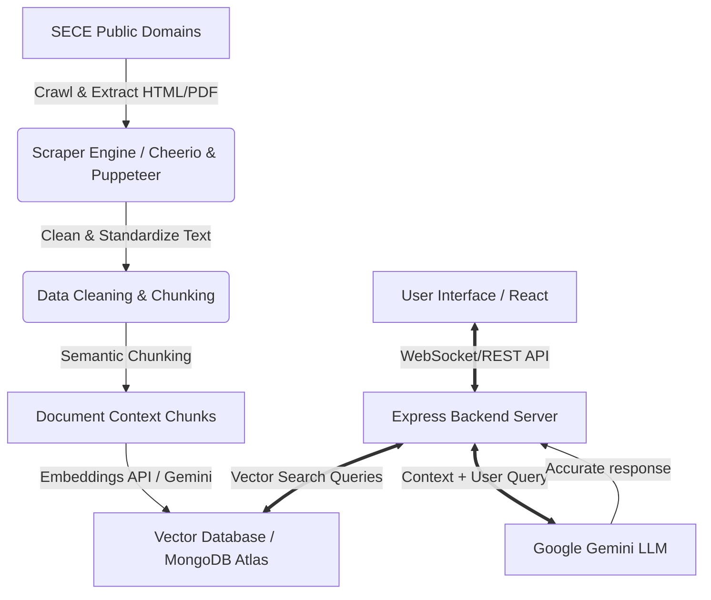

# Dynamic Universal RAG Assistant

An advanced, context-aware Retrieval-Augmented Generation (RAG) conversational agent engineered to scrape, process, index, and retrieve hyper-specific information from any configured digital presence. 

Beyond simple FAQ lookup, this system leverages modern NLP chunking, high-dimensional vector embeddings, and the Google Gemini LLM to answer detailed, granular queries (e.g., student projects, niche technical patterns, and event histories) with deep contextual accuracy and zero hallucination.

---

## 🏗️ System Architecture

The project is structured as a full-stack MERN application integrated with an automated web scraping pipeline and the Gemini API.



---

## 🛠️ Technology Stack

| Component | Technology | Purpose |
| :--- | :--- | :--- |
| **Frontend UI** | React.js, Vite, Vanilla CSS | Fluid, interactive, and premium chat interface with persistent state. |
| **Backend API** | Node.js, Express.js | API routing, session management, Gemini integration, and vector store queries. |
| **Scraper Pipeline** | Node.js, Axios, Cheerio | Robust, recursive crawling, metadata extraction, and semantic chunking. |
| **Database** | MongoDB (Atlas Vector Search) | Vector storing of page chunks, chat history persistence, and analytics. |
| **AI & LLM Engine** | Google Gemini API | Natural language understanding, intent extraction, and synthesized contextual responses. |

---

## 📂 Project Structure

```
.
├── README.md                 # Project documentation
├── .gitignore                # Root gitignore rules
├── backend/                  # Express API Server
│   ├── src/
│   │   ├── server.js         # Entry point
│   │   ├── config/           # DB & API Configurations
│   │   ├── models/           # Mongoose Schemas (ChatHistory, Analytics, Chunks)
│   │   ├── routes/           # API Endpoints
│   │   └── services/         # Gemini API & Vector Search Services
│   ├── package.json
│   └── .env.example
├── frontend/                 # React UI Client
│   ├── src/
│   │   ├── main.jsx          # Entry point
│   │   ├── App.jsx           # Root layout & chat interface
│   │   └── index.css         # Styling system
│   ├── index.html
│   ├── vite.config.js
│   └── package.json
└── scraper/                  # Ingestion Pipeline
    ├── crawler.js            # Recursive crawling script
    ├── chunker.js            # Semantic chunking logic
    ├── package.json
    └── .env.example
```

---

## 🚀 Getting Started

### Prerequisites
- Node.js (v18 or higher)
- MongoDB Atlas account (or a local instance with Atlas Vector Search capability)
- Google Gemini API Key

---

### Setup Instructions

#### 1. Clone the Repository
```bash
git clone <repository-url>
cd "SECE Intelligent RAG-Bot"
```

#### 2. Backend Setup
1. Navigate to the backend directory:
   ```bash
   cd backend
   ```
2. Install dependencies:
   ```bash
   npm install
   ```
3. Create `.env` from `.env.example` and supply your secrets:
   ```env
   PORT=5000
   MONGO_URI=mongodb+srv://...
   GEMINI_API_KEY=your_gemini_api_key_here
   ```
4. Start the backend development server:
   ```bash
   npm run dev
   ```

#### 3. Frontend Setup
1. Navigate to the frontend directory:
   ```bash
   cd ../frontend
   ```
2. Install dependencies:
   ```bash
   npm install
   ```
3. Start the Vite development server:
   ```bash
   npm run dev
   ```

#### 4. Scraper & Ingestion Setup
1. Navigate to the scraper directory:
   ```bash
   cd ../scraper
   ```
2. Install dependencies:
   ```bash
   npm install
   ```
3. Run the ingestion pipeline to crawl, chunk, embed, and store SECE site data:
   ```bash
   npm start
   ```

---

## 🧠 RAG Pipeline Execution Details

1. **Deep Scraping & Cleaning**:
   - The crawler maps the domain recursively.
   - HTML tags are cleaned, boilerplate navigation headers/footers are stripped, and main content blocks are kept.
2. **Semantic Chunking**:
   - Chunks are created using paragraph or semantic boundaries (keeping metadata like page title, URL, department tags).
3. **Embeddings & Indexing**:
   - Each chunk generates a vector using Google Gemini's embedding model.
   - Chunks are stored in MongoDB with their embedding vector.
4. **Retrieval**:
   - User query is converted to a vector embedding.
   - Vector search performs cosine similarity query against the database.
   - Top matching context chunks are retrieved.
5. **Generation**:
   - The original query + retrieved context chunks are constructed into a custom system prompt and sent to Gemini LLM to synthesize the final response.

---

## ⚖️ Acceptance Criteria

- **Deep Contextual Accuracy**: Must correctly answer granular questions about SECE projects, events, and patterns.
- **Zero Hallucination**: Transparently reports when an answer is not found in official crawled documents.
- **Sync capability**: Easy re-indexing to pull down fresh updates from the website.
