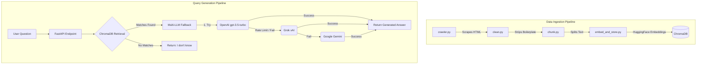

# SECE Intelligent RAG Assistant

A full-stack Retrieval-Augmented Generation (RAG) chatbot specifically built for the Sri Eshwar College of Engineering (SECE) website. The bot crawls the college website, indexes its contents into a vector database, and uses state-of-the-art LLMs to provide highly accurate, hallucination-free answers to user queries.

---

## 🏗 Architecture & Flow

The system operates in two distinct phases: **Data Ingestion** and **Query Generation**.



### 🧠 Multi-LLM Waterfall Fallback
To ensure maximum uptime and reliability, the backend uses a robust fallback mechanism. If the primary OpenAI key is out of quota (Error 429) or offline, the system seamlessly routes the query to **Grok (x.AI)**. If Grok fails, it falls back to **Google Gemini**.

### 🛡 Hallucination Prevention
The system is heavily prompted with strict constraints to *only* answer using the retrieved SECE context. If a user asks an unrelated question (e.g., "What is the capital of France?"), the bot will explicitly reply: *"I couldn't find that information on the SECE website."*

---

## 🛠 Technologies Used

- **Backend**: Python 3.11, FastAPI, Uvicorn
- **AI & RAG Engine**: LangChain, HuggingFace (`all-MiniLM-L6-v2`), ChromaDB
- **LLM Providers**: OpenAI (`gpt-3.5-turbo`), xAI Grok (`grok-beta`), Google Gemini (`gemini-1.5-flash`)
- **Web Scraping**: BeautifulSoup4, Requests
- **Frontend**: Vanilla JavaScript, HTML5, CSS3 (Premium Dark Mode / Glassmorphism)

---

## 📂 Project Structure

```text
sece-rag-bot/
├── scraper/
│   ├── crawler.py           # Crawls sece.ac.in and bypasses robots.txt for testing
│   └── data/                # Raw, clean, and chunked JSON files
├── processing/
│   ├── clean.py             # Strips HTML boilerplate and spam links
│   └── chunk.py             # Splits text into 800-character chunks
├── indexing/
│   └── embed_and_store.py   # Vector DB upsert using ChromaDB
├── chroma_db/               # SQLite database for vector embeddings
├── api/
│   ├── main.py              # FastAPI application server
│   └── rag_pipeline.py      # LangChain retrieval and Multi-LLM fallback logic
├── frontend/
│   ├── index.html           # Main UI layout
│   ├── style.css            # Dark mode, glassmorphism styles
│   └── app.js               # Frontend chat interactions
├── .env                     # Environment variables (API keys)
├── requirements.txt         # Project dependencies
├── .gitignore               # Git ignore file
└── README.md                # Project documentation
```

---

## 🚀 Setup & Usage

### 1. Installation
Clone the repository and install the dependencies:
```bash
pip install -r requirements.txt
```
*(Note: NumPy is constrained to `<2` to avoid binary incompatibility with scikit-learn and Langchain).*

### 2. Environment Variables
Create a `.env` file in the root directory and add your API keys:
```env
OPENAI_API_KEY=your_openai_key
GROK_API=your_grok_key
GEMINI=your_gemini_key
```

### 3. Build the Database (Data Pipeline)
Run the following scripts in order to scrape the website and build the local vector database:
```bash
python scraper/crawler.py
python processing/clean.py
python processing/chunk.py
python indexing/embed_and_store.py
```

### 4. Run the Server
Start the FastAPI server:
```bash
python -m uvicorn api.main:app --host 0.0.0.0 --port 8001
```
Open your browser and navigate to `http://localhost:8001` to start chatting!
